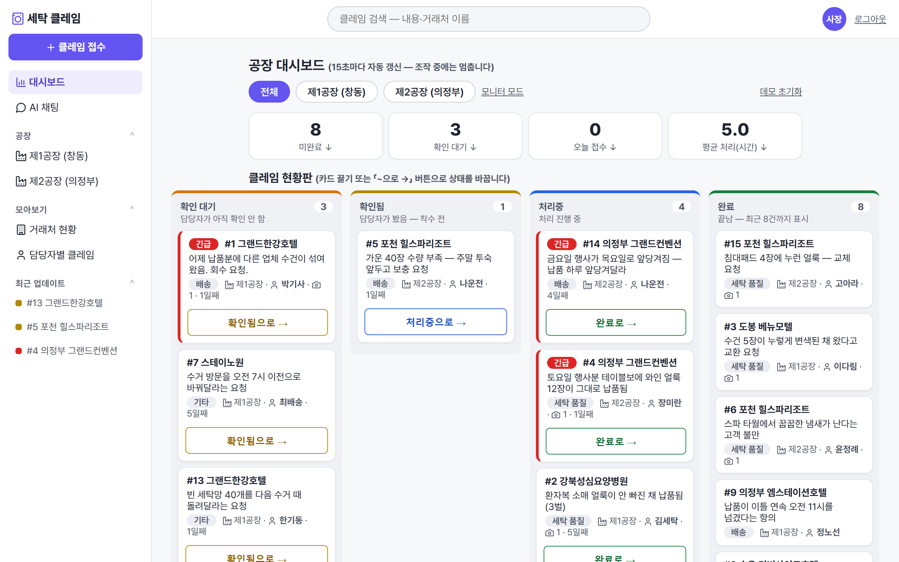
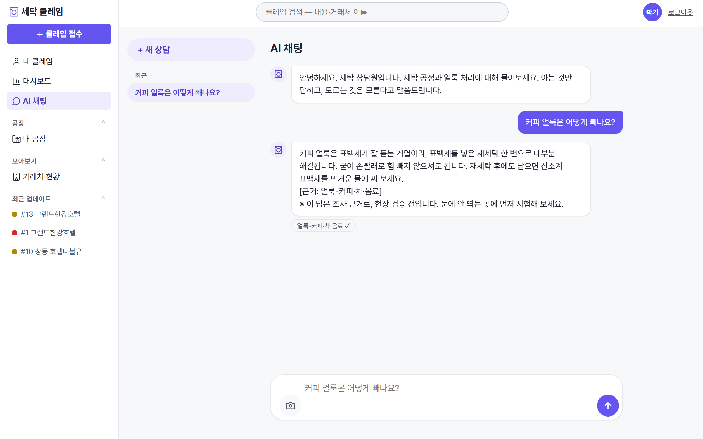

# 🧺 세탁 클레임 (laundry-claim)

세탁공장이 전화·문자로 받던 거래처 클레임을 **접수 → 담당자 배정·전달 → 조치 → 완료**까지 추적하는 웹 서비스.

**🔗 데모: https://laundry-claim.onrender.com** — 로그인 화면에서 아무 역할이나 골라 체험 (무료 서버라 첫 접속은 깨어나는 데 1분쯤 걸릴 수 있습니다)

> 세탁공장에서 3년 가까이 현장을 총괄하며 겪은 실제 문제에서 출발했다. 거래처 클레임이 전화·문자로 오가면
> ①기록이 안 남고 ②전달됐는지 확인이 안 되고 ③처리 이력이 흩어진다.
> 배송기사는 대부분 투잡·프리랜서라 공장 사정을 모르는데, 특이사항 전달이 매번 사장의 전화 한 통이었다.
> 이 서비스는 그 전화 한 통을 기록·전달·추적이 되는 시스템으로 바꾼 것이다.



## 기능

- **클레임 접수** — 거래처·유형(품질/배송/기타)·심각도·사진(여러 장, 촬영 또는 앨범)·담당자 배정·지시
- **칸반 현황판** — 접수 → 확인됨 → 처리중 → 완료. 카드 끌어놓기(데스크톱)·다음 단계 버튼(모바일), 이동도 조치 일지에 자동 기록
- **조치 일지** — 지시(어떻게 해야 하는지)와 처리 보고(어떻게 했는지)가 시간순으로만 쌓이는 append-only 타임라인
- **역할별 화면(인가)** — 본사는 전체, 공장 사람은 자기 공장만, 내 클레임은 본인만. 조치 기록의 「누가」는 로그인 기준
- **대시보드** — 지표 4개(클릭하면 해당 상세로 드릴다운) + 현황판 + 접힌 상세. 공장별 탭
- **거래처별 미니 대시보드** — 업체마다 누적·평균 처리 시간·유형별 지표와 그 업체만의 현황판
- **검색** — 내용·거래처 이름으로 글자 검색 (역할 범위 안에서)
- **카톡 알림** — 새 클레임 접수 시 관리자 카톡으로 알림 (「나에게 보내기」, 화면에서 연동·해제)
- **AI 채팅** — 세탁 지식·내 업무를 묻는 대화형 도우미 (아래 「AI 채팅」 절 참조)

## 스택

Python 3.12 · FastAPI · PostgreSQL(배포, Neon)/SQLite(로컬) · Jinja2(서버 렌더링) · 순수 JS 약간(드래그·미리보기·드릴다운)

- 표 11장: 공장 · 거래처 · 품목 · 거래처별 품목(N:M) · 담당자 · 클레임 · 조치(append-only) · 사진(1:N) · 설정(카톡 토큰) · 대화방 · 대화글
- DB는 이중 지원 — 로컬 개발은 SQLite 파일 하나, 배포는 `DATABASE_URL` 환경변수만으로 PostgreSQL로 전환.
  두 DB의 차이(자리표·id 반환·날짜 계산·DDL)는 얇은 어댑터 한 겹에 가둬 본문 코드는 공용
- 데이터는 전부 가상 — 실존 호텔·모텔의 유형·규모만 본떴다(하루 물량 = 객실수 × 가동률 70% × 세트)
- 로그인은 데모용 간이 방식(이름 선택 + 쿠키). 인가(누가 무엇을 보나)는 전 화면에 구현, 인증(비밀번호)은 로드맵

## AI 채팅 — 서버 밖의 두뇌



배포 서버에는 모델이 없다. 실제 두뇌는 **개인 노트북에서 도는 로컬 LLM**(Ollama · Qwen3 8B)이고,
배포 서버는 질문을 고정 터널로 중계하는 프록시만 맡는다 — 무료 서버로 GPU 추론을 제공하기 위한 구조다.

- **사서 방식** — 모델이 아는 척하지 않도록, 미리 검수한 세탁 지식 문서에서 근거를 찾아 답하고
  답마다 근거 딱지를 단다. 아는 범위 밖 질문은 거절한다
- **합격선 시험** — 질문 100문 배치 시험을 통과한 버전만 터널에 연결한다 (답변 품질의 회귀 방지)
- **업무 질문** — "오늘 할 일 뭐야?"라고 물으면 로그인 사용자의 미완료 배정 티켓과 최신 지시를
  모델에 함께 보내, 실제 업무 데이터 기반으로 답한다
- **대화방** — 주제별 여러 대화방, 이력은 DB에 저장(새로고침·재접속에도 유지), 최근 6턴을 문맥으로 승계
- **사진 첨부** — 얼룩 사진을 보내면 축소·개인정보(EXIF) 제거 후 노트북에 수집된다(판독 기능의
  학습 재료). 판독은 아직 지원하지 않으며, 모델이 사진을 본 척하지 않도록 가드가 막는다 —
  "모르는 것은 모른다"의 사진판
- 두뇌 주소(`BRAIN_URL`)가 없으면 메뉴 자체가 숨는다 — 노트북 없이도 나머지 배포물은 그대로 동작

## 실행

```bash
pip install -r requirements.txt
uvicorn app:app --port 8123
# → http://127.0.0.1:8123  (첫 실행 때 예시 데이터와 데모 사진이 자동 생성된다)
```

## 로드맵 (v2)

- ~~SQLite → PostgreSQL 이관~~ — **완료(2026-08)**: 배포 데이터가 서버 재시작을 견딘다 (무료 Neon, 카드 등록 없음)
- ~~알림~~ — **완료(2026-08)**: 카카오톡 「나에게 보내기」로 새 클레임 접수 시 관리자 카톡 알림.
  OAuth 토큰은 DB에 보관·자동 갱신, 화면에서 연동·테스트·해제. (SMS는 유료·발신번호 등록 절차라 제외)
- 실제 인증(비밀번호) — 공개 운영 전환 시

## 만든 방식

Claude Code와 함께 하루 만에 v1을 만들고, 실사용 피드백 순서대로 20여 개 커밋을 쌓았다.
설계 판단(무엇을 넣고 뺄지, 현장 용어, 품목 구성, 역할 규칙)은 세탁공장 운영 경험에서 나왔다.
